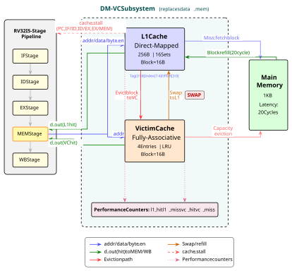
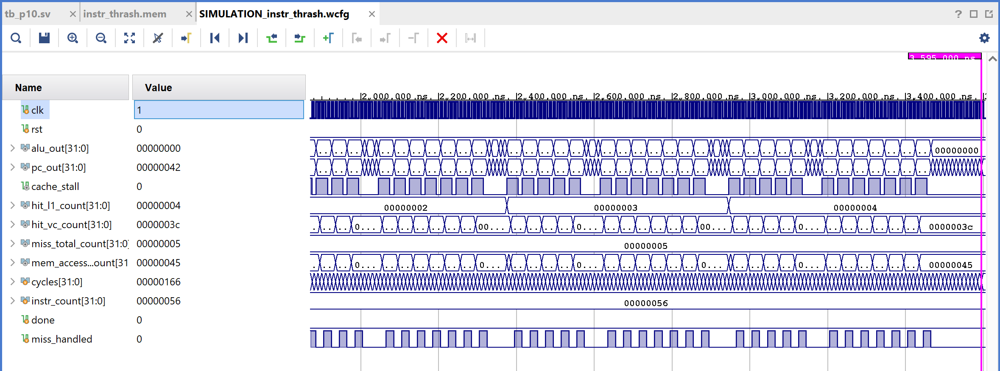

# 🚀 RISC-V Victim Cache Implementation on FPGA

This repository contains the RTL design and verification environment for a **4-entry fully-associative victim cache** integrated into a RISC-V (RV32I) baseline architecture. The design is targeted and tested on the Xilinx Zybo Z7-10 FPGA.

## 🧠 Architecture Overview

*Above: High-level architectural block diagram showing the integration of the Victim Cache between the L1 Cache and Main Memory.*

The victim cache sits directly between the L1 cache and main memory to safely catch and hold evicted blocks, reducing the severe penalty of conflict misses. 
* **Associativity:** Fully Associative (4 entries)
* **Replacement Policy:** LRU (Least Recently Used)
* **Functionality:** On an L1 miss, the victim cache is checked. If the requested block is found (a victim hit), it is quickly swapped back into the L1 cache, bypassing the slow main memory fetch entirely.

## 📊 Simulation & Waveforms

The testbenches evaluate performance under different memory access patterns, specifically targeting instruction thrashing scenarios where the victim cache prevents severe performance degradation.

*Above: Simulation waveform demonstrating cache hits, misses, and victim cache data swapping during an instruction thrashing sequence.*

## ⚙️ Simulation Setup & Configuration

Because the testbenches involve heavy memory thrashing and extensive LRU logic verification, the default Vivado simulation runtime (1000ns) is not long enough to capture all the cache hit/miss events. 

**If you are running the simulation manually in Vivado, please ensure you extend the runtime:**
1. Go to **Settings** (Flow Navigator) -> **Simulation**.
2. Change the `xsim.simulate.runtime` value to `1000000ns` (or `1ms`).
3. Run the simulation.

## 📂 Directory Structure

* 📁 `rtl/` - Core SystemVerilog source files (RV32I core, L1 cache, and `victim_cache.sv`).
* 📁 `tb/` - Testbenches designed for spatial and thrashing instruction scenarios.
* 📁 `mem/` - Memory initialization files (`.mem`) for instruction and data loading.
* 📁 `P10_Victim_Cache.srcs/constrs_1/` - Physical constraint files (`.xdc`) for the Zybo Z7-10 board.

## 🛠️ Tools Used
* **Synthesis & Implementation:** Xilinx Vivado
* **Simulation:** Vivado Simulator (XSim)
* **Languages:** SystemVerilog / Verilog